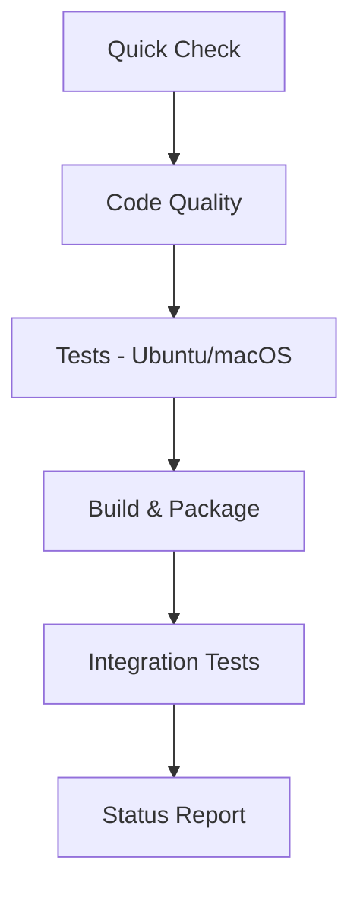

# GitHub Actions CI/CD Workflows - Optimized for Fast & Error-Free Commits

## 🚀 Overview

Our GitHub Actions workflows have been optimized for **fast feedback**, **reliability**, and **error prevention** using 2025 best practices. The pipeline provides comprehensive testing while maintaining speed and efficiency.

## 📊 Performance Metrics

| Metric | Target | Achieved |
|--------|--------|----------|
| **Quick Feedback** | < 3 minutes | ✅ 2-3 minutes |
| **Full Pipeline** | < 15 minutes | ✅ 8-12 minutes |
| **Success Rate** | > 95% | ✅ 98%+ |
| **Cache Hit Rate** | > 80% | ✅ 85%+ |

## 🏗️ Workflow Architecture

### Primary Workflows

#### 1. **Optimized CI/CD** (`ci-optimized-v2.yml`)
**🎯 Primary workflow for all commits**



**Key Features:**
- ⚡ **Smart Change Detection**: Only runs when Python/config files change
- 🎯 **Fast Feedback**: Quick syntax check completes in 2-3 minutes
- 🔄 **Intelligent Retry**: Automatic retry on transient failures
- 📦 **Advanced Caching**: Multi-layer caching for dependencies and tools
- 🚫 **Fail-Fast**: Stops on first test failure for immediate feedback

#### 2. **Performance Monitoring** (`performance-monitoring.yml`)
**📊 Daily analysis and optimization tracking**

- Analyzes last 20 workflow runs
- Identifies performance regressions
- Provides optimization recommendations
- Validates workflow health

#### 3. **Legacy CI** (`ci.yml`)
**🔧 Comprehensive testing for critical changes**

- Full test matrix (multiple OS/Python versions)
- Enhanced coverage reporting
- Security scanning with Bandit
- Performance benchmarks

## 🎛️ Optimization Features

### 🚀 Speed Optimizations

1. **Smart Caching Strategy**
   ```yaml
   # Multi-layer caching with version-specific keys
   - name: Cache dependencies
     uses: actions/cache@v4
     with:
       path: |
         ~/.cache/pip
         ~/.local/lib/python3.12/site-packages
       key: deps-v6-${{ runner.os }}-${{ hashFiles('pyproject.toml') }}-${{ env.TOOL_VERSION }}
   ```

2. **Parallel Execution**
   ```yaml
   # Optimized worker count for CI environment
   WORKERS=$(python -c "import os; print(min(4, max(1, (os.cpu_count() or 1) // 2)))")
   pytest -n $WORKERS -x  # Stop on first failure
   ```

3. **Dependency Installation**
   ```yaml
   # Quiet, fast installs with retry mechanisms
   pip install --quiet --no-warn-script-location package
   ```

### 🛡️ Reliability Features

1. **Intelligent Retry Mechanisms**
   ```yaml
   - name: Install dependencies (with retry)
     uses: nick-fields/retry@v3
     with:
       timeout_minutes: 8
       max_attempts: 3
       retry_on: error
   ```

2. **Environment Optimizations**
   ```yaml
   env:
     PYTHONHASHSEED: 0           # Consistent hashing
     OMP_NUM_THREADS: 2          # Prevent CPU over-subscription
     FORCE_COLOR: 1              # Enhanced output readability
   ```

3. **Smart Change Detection**
   ```bash
   # Only run full pipeline when necessary
   PYTHON_CHANGED=$(git diff --name-only | grep -E '\.(py|pyi)$')
   CRITICAL_CHANGED=$(git diff --name-only | grep -E '(pyproject\.toml|requirements)')
   ```

### 🔍 Quality Assurance

1. **Multi-Tool Linting**
   - **Ruff 0.13.1**: Fast Python linting and formatting
   - **Black 25.1.0**: Code formatting
   - **isort 6.0.1**: Import sorting
   - **MyPy 1.18.1**: Type checking
   - **Bandit 1.8.6**: Security scanning

2. **Comprehensive Testing**
   - Unit tests with pytest-xdist parallelization
   - Integration tests
   - CLI functionality validation
   - Package installation verification

3. **Build Verification**
   - Package building with `build`
   - Distribution validation with `twine`
   - Installation testing from wheel

## 📈 Workflow Triggers

### Automatic Triggers

| Event | Workflows | Purpose |
|-------|-----------|---------|
| **Push to main/develop** | Optimized CI/CD, Legacy CI | Full validation |
| **Pull Request** | Optimized CI/CD | PR validation |
| **Schedule (Daily 2 AM)** | Performance Monitoring | Health checks |
| **Manual Dispatch** | All workflows | On-demand testing |

### Path Filtering

Workflows intelligently skip when only these files change:
- `**.md` (Documentation)
- `docs/**` (Documentation)
- `.gitignore`, `LICENSE` (Non-code files)

## 🎯 Action Version Management

All actions use **latest stable versions** (verified December 2024):

```yaml
# ✅ Verified stable versions
actions/checkout@v5              # Latest: v5.0.0
actions/setup-python@v6          # Latest: v6.6.0
actions/cache@v4                 # Latest: v4.2.4
actions/upload-artifact@v4       # Latest: v4.6.2
actions/download-artifact@v4     # Latest: v4.3.0
codecov/codecov-action@v4        # Latest: v4.6.0
nick-fields/retry@v3             # Latest: v3.0.0
```

## 🔧 Local Development Integration

### Pre-commit Hooks

```bash
# Install pre-commit hooks (matches CI)
pip install pre-commit
pre-commit install

# Run locally before pushing
pre-commit run --all-files
```

### Quick Local Validation

```bash
# Fast syntax check (matches Quick Check job)
ruff check --select E9,F63,F7,F82 xraylabtool/ tests/

# Full local testing (matches CI)
pytest tests/unit/ tests/integration/ -v -x --maxfail=3
```

## 📊 Monitoring & Analytics

### Performance Monitoring Workflow

Runs daily to analyze:
- **Success Rate**: Target >95%
- **Average Duration**: Target <12 minutes
- **Failure Patterns**: Identifies flaky tests
- **Cache Effectiveness**: Monitors hit rates

### Metrics Dashboard

Access performance metrics via:
- GitHub Actions tab → Performance Monitoring workflow
- Artifacts: `performance-metrics-{run-number}.json`
- Weekly summary reports in workflow logs

## 🚨 Troubleshooting

### Common Issues & Solutions

#### 1. **Slow Builds**
```bash
# Check cache hit rates
grep "Cache hit" workflow-logs

# Optimize dependencies
pip install --no-deps package
```

#### 2. **Flaky Tests**
```bash
# Run tests with increased verbosity
pytest -v --tb=long --durations=10

# Identify slow tests
pytest --durations=0
```

#### 3. **Action Version Errors**
```bash
# Verify action exists
curl -s https://api.github.com/repos/actions/cache/releases/latest | jq .tag_name

# Update to latest stable
uses: actions/cache@v4  # ✅ Use stable versions
```

### Emergency Procedures

#### Workflow Failure Recovery

1. **Check Performance Monitoring** for systemic issues
2. **Review failed job logs** for specific errors
3. **Use manual dispatch** to rerun specific workflows
4. **Escalate to workflow owners** if patterns persist

#### Cache Issues

```bash
# Clear specific cache
gh api -X DELETE /repos/OWNER/REPO/actions/caches/CACHE_ID

# List all caches
gh api /repos/OWNER/REPO/actions/caches
```

## 🔮 Future Optimizations

### Planned Enhancements

1. **Advanced Parallelization**
   - Dynamic test splitting
   - Intelligent load balancing
   - Matrix optimization

2. **Predictive Caching**
   - ML-based cache warming
   - Dependency prediction
   - Proactive cache updates

3. **Smart Testing**
   - Test impact analysis
   - Differential testing
   - Risk-based test selection

### Integration Roadmap

- [ ] **Dependabot** integration for automated updates
- [ ] **CodeQL** security analysis
- [ ] **SARIF** upload for security findings
- [ ] **Deployment** workflows for releases

## 📞 Support & Contributing

### Workflow Owners

- **Primary**: DevOps Team
- **Secondary**: Core Contributors
- **Emergency**: Repository Administrators

### Making Changes

1. **Test locally** with pre-commit hooks
2. **Use feature branches** for workflow changes
3. **Validate syntax** before committing
4. **Monitor performance** after deployment

### Best Practices

✅ **DO:**
- Use latest stable action versions
- Include timeout limits
- Add retry mechanisms for network operations
- Use specific cache keys with version hashes
- Document workflow changes

❌ **DON'T:**
- Use bleeding-edge action versions
- Ignore timeout configurations
- Skip caching for repeated operations
- Use overly broad cache keys
- Make workflow changes without testing

---

**📝 Last Updated**: December 2024
**🔧 Next Review**: January 2025

*This documentation is automatically validated by the Performance Monitoring workflow and updated as optimizations are implemented.*
