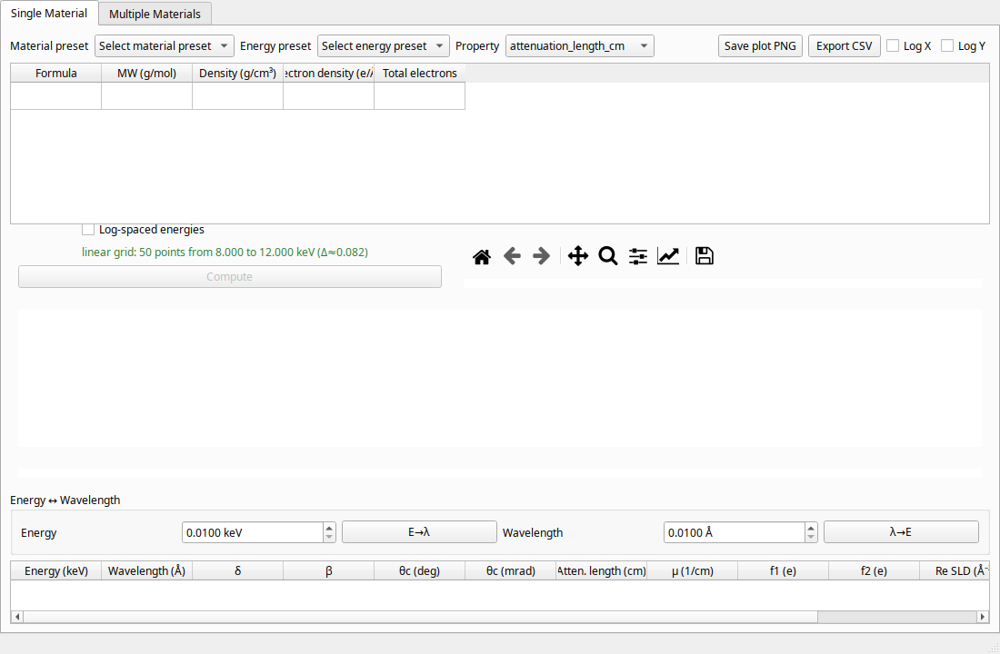

# XRayLabTool

[](https://www.python.org/downloads/)
[](https://badge.fury.io/py/xraylabtool)
[](https://opensource.org/licenses/MIT)
[](https://pyxraylabtool.readthedocs.io/en/latest/?badge=latest)
[](https://github.com/imewei/pyXRayLabTool/actions/workflows/ci.yml)

Ultra-fast Python package and CLI for calculating X-ray optical properties of materials using CXRO/NIST atomic scattering factor data. Supports NumPy and JAX backends for CPU/GPU acceleration.

## Installation

```bash
pip install xraylabtool

# With JAX backend for GPU acceleration
pip install xraylabtool[jax]

# With matplotlib for publication plots
pip install xraylabtool[plots]

# Development (uses uv)
git clone https://github.com/imewei/pyXRayLabTool.git
cd pyXRayLabTool
uv sync
```

## Quick Start

### Python API

```python
import xraylabtool as xlt

# Single material at 10 keV
result = xlt.calculate_single_material_properties("SiO2", 10.0, 2.2)
print(f"Critical angle: {result.critical_angle_degrees[0]:.3f}°")
print(f"Attenuation length: {result.attenuation_length_cm[0]:.2f} cm")

# Multiple materials comparison
materials = {"SiO2": 2.2, "Si": 2.33, "Al2O3": 3.95, "C": 3.52}
results = xlt.calculate_xray_properties(
    list(materials.keys()), 10.0, list(materials.values())
)
for formula, r in results.items():
    print(f"{formula:6}: θc = {r.critical_angle_degrees[0]:.3f}°")
```

### Command-Line Interface

```bash
xraylabtool calc SiO2 -e 10.0 -d 2.2           # Single material
xraylabtool calc Si -e 5-15:11 -d 2.33 -o out.csv  # Energy sweep
xraylabtool convert energy 8.048,10.0 --to wavelength
xraylabtool formula Al2O3                         # Formula analysis
xraylabtool bragg -d 3.14,2.45 -e 8.048          # Bragg angles
xraylabtool batch materials.csv -o results.csv    # Batch processing
xraylabtool completion install                    # Shell tab-completion
```

### GUI

```bash
python -m xraylabtool.gui
```

Single-material analysis and multi-material comparison with interactive plots and CSV/PNG export.



## Calculated Properties

| Property | Field | Unit |
|----------|-------|------|
| Dispersion coefficient | `dispersion_delta` | dimensionless |
| Absorption coefficient | `absorption_beta` | dimensionless |
| Scattering factors | `scattering_factor_f1`, `f2` | electrons |
| Critical angle | `critical_angle_degrees` | degrees |
| Attenuation length | `attenuation_length_cm` | cm |
| Scattering length density | `real_sld_per_ang2`, `imaginary_sld_per_ang2` | Å⁻² |

All properties are returned as NumPy arrays in the `XRayResult` dataclass, supporting single energies or energy sweeps.

## Backend Selection

```python
import xraylabtool as xlt

# Switch to JAX for JIT-compiled GPU acceleration
xlt.set_backend("jax")

# Switch back to NumPy (default)
xlt.set_backend("numpy")
```

## Scientific Background

Calculations use Henke, Gullikson, and Davis atomic scattering factor tabulations (0.03–30 keV):

- **Refractive index**: n = 1 - δ - iβ
- **Critical angle**: θc = √(2δ)
- **Attenuation**: Beer-Lambert law with μ = 4πβ/λ

## Documentation

Full documentation: **[pyxraylabtool.readthedocs.io](https://pyxraylabtool.readthedocs.io)**

- [API Reference](https://pyxraylabtool.readthedocs.io/en/latest/api/)
- [CLI Guide](https://pyxraylabtool.readthedocs.io/en/latest/guides/cli_reference.html)
- [Migration Guide (v0.3 → v0.4)](https://pyxraylabtool.readthedocs.io/en/latest/guides/migration_guide_v0_4.html)
- [Architecture Decisions](https://pyxraylabtool.readthedocs.io/en/latest/architecture/)
- [Changelog](CHANGELOG.md)

## Development

```bash
uv sync                          # Install dependencies
uv run pytest                    # Run tests
uv run ruff check .              # Lint
uv run ruff format .             # Format
uv run sphinx-build docs docs/_build  # Build docs
make test                        # Or use Makefile shortcuts
```

## Citation

```bibtex
@software{xraylabtool,
  title = {XRayLabTool: High-Performance X-ray Optical Properties Calculator},
  author = {Wei Chen},
  url = {https://github.com/imewei/pyXRayLabTool},
  version = {0.4.1},
  year = {2024--2026}
}
```

## License

MIT License. See [LICENSE](LICENSE) for details.

## Acknowledgments

- [CXRO](https://henke.lbl.gov/optical_constants/) — Atomic scattering factor databases
- [NIST](https://www.nist.gov/) — Reference data and validation
